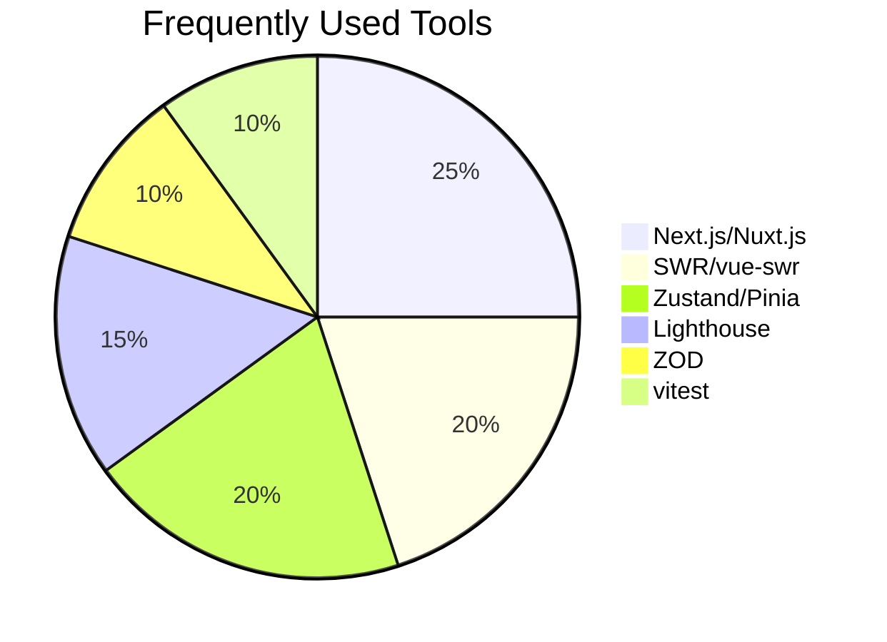
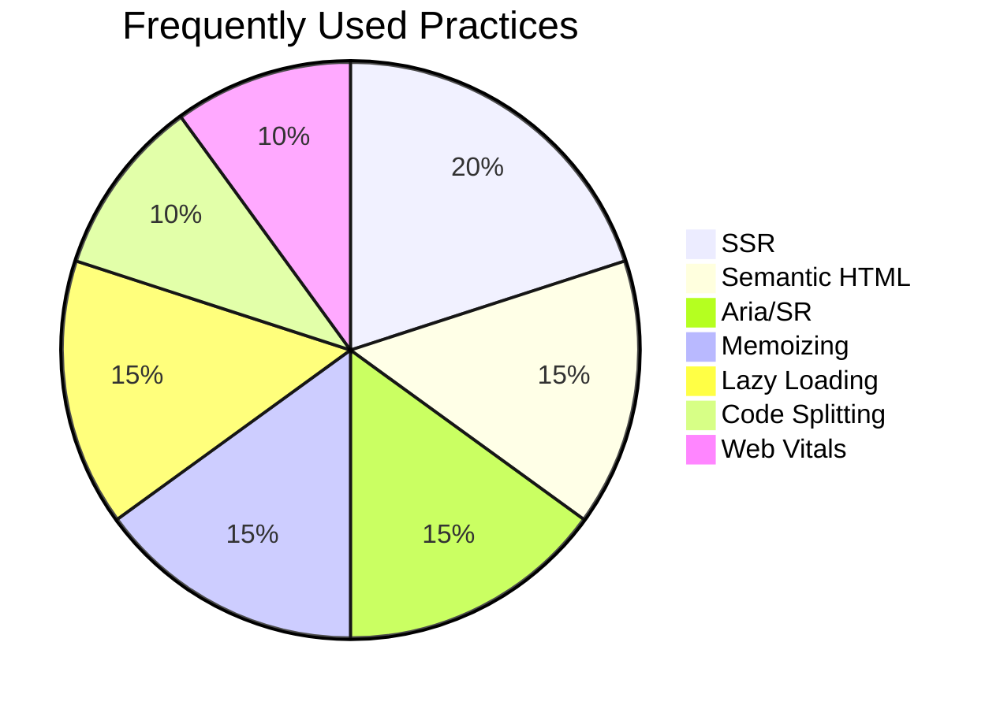

# 👋 Hi, I'm Saqib - Berlin-Based Web Developer

Passionate about building accessible, high-performance applications using modern technologies. Focused on implementing best practices in frontend development, SEO optimization, and creating seamless user experiences.

## 🔧 Tech Stack

  
  
  
  
  
  

## 📈 GitHub Stats

## 🛠️ Tools Visualization

## 🛠️ practices Visualization

## 🏆 Featured Projects

| Project | Description | Tech Stack |
|---------|-------------|------------|
| [💸 Currency Transfer App](https://github.com/saqibroy/currency-transfer) | Multi-currency transaction platform | Rails, React, PostgreSQL |

## 📬 Let's Connect

<!--
**saqibroy/saqibroy** is a ✨ _special_ ✨ repository because its `README.md` (this file) appears on your GitHub profile.

Here are some ideas to get you started:

- 🔭 I’m currently working on ...
- 🌱 I’m currently learning ...
- 👯 I’m looking to collaborate on ...
- 🤔 I’m looking for help with ...
- 💬 Ask me about ...
- 📫 How to reach me: ...
- 😄 Pronouns: ...
- ⚡ Fun fact: ...

| [🐦 Tweet Fetcher](https://github.com/saqibroy/tweet-fetcher) | Real-time social media dashboard | Vue.js, Tailwind, Express |
| [✅ Todo Manager](https://github.com/saqibroy/todo-manager) | Accessibility-focused task management | Next.js, Zustand, Axe |
-->
