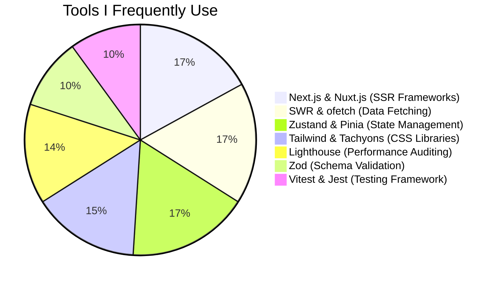
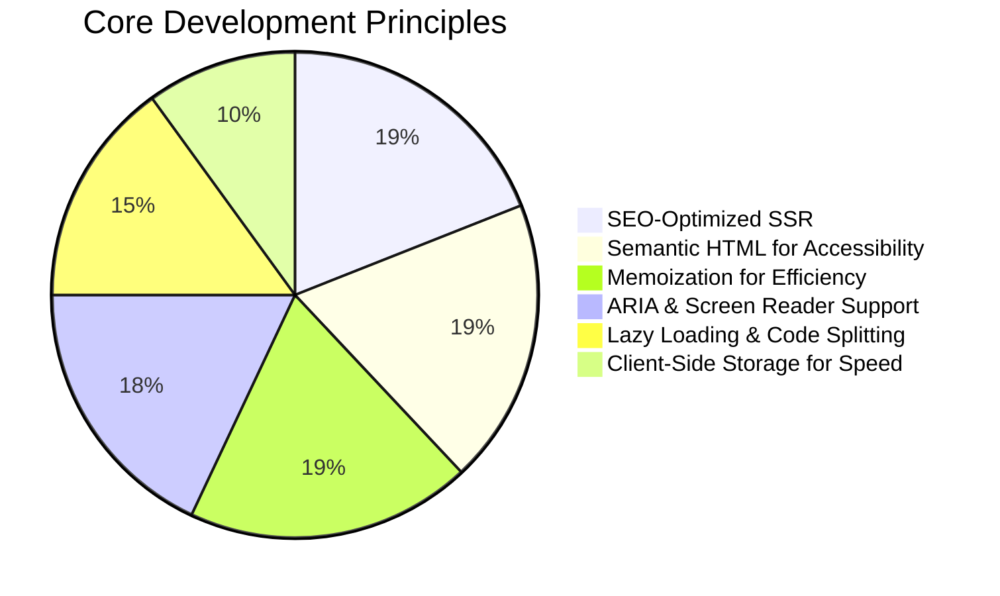

# 👋 Hi, I'm Saqib
## An experianced web developer based in Berlin, Germany
My focus lies in optimizing performance through modern techniques, ensuring accessibility for all users, and implementing SEO best practices to drive visibility and engagement. With experience working with Berlin-based companies, I bring a strong technical foundation and a commitment to delivering scalable, user-centric solutions.

## 📬 Let's Connect

## Languages and tools

<table width="100%" style="border-collapse: collapse;">
  <tr>
    <!-- Frontend -->
    <td width="80px" align="center" style="border: 1px solid #eee; padding: 8px">
      
    </td>
    <td width="80px" align="center" style="border: 1px solid #eee; padding: 8px">
      
    </td>
    <td width="80px" align="center" style="border: 1px solid #eee; padding: 8px">
      
    </td>
    <td width="80px" align="center" style="border: 1px solid #eee; padding: 8px">
      
    </td>
    <td width="80px" align="center" style="border: 1px solid #eee; padding: 8px">
      
    </td>
  </tr>
  
  <tr>
    <td width="80px" align="center" style="border: 1px solid #eee; padding: 8px">
      
    </td>
    <td width="80px" align="center" style="border: 1px solid #eee; padding: 8px;">
      
    </td>
    <td width="80px" align="center" style="border: 1px solid #eee; padding: 8px">
      
    </td>
    <td width="80px" align="center" style="border: 1px solid #eee; padding: 8px">
      
    </td>
    <td width="80px" align="center" style="border: 1px solid #eee; padding: 8px">
      
    </td>
  </tr>
  
  <tr>
    <td width="80px" align="center" style="border: 1px solid #eee; padding: 8px">
      
    </td>
    <td width="80px" align="center" style="border: 1px solid #eee; padding: 8px">
      
    </td>
    <td width="80px" align="center" style="border: 1px solid #eee; padding: 8px">
      
    </td>
    <td width="80px" align="center" style="border: 1px solid #eee; padding: 8px">
      
    </td>    
    <td width="80px" align="center" style="border: 1px solid #eee; padding: 8px">
      
    </td>
  </tr>
</table>

## GitHub Stats

## Modern Development Tools and Principles

## 🏆 Featured Projects

| Project | Description | Tech Stack |
|---------|-------------|------------|
| [Virtual Currency Transfer App](https://github.com/saqibroy/virtual-currency-transfer-app ) | Multi-currency transaction platform | Rails, React, PostgreSQL |
| [Modern Notes App](https://github.com/saqibroy/notes-app-react-vite) | Notes app created using modern tech stack | React, Mantine, Jest |

<!--
**saqibroy/saqibroy** is a ✨ _special_ ✨ repository because its `README.md` (this file) appears on your GitHub profile.

Here are some ideas to get you started:

- 🔭 I’m currently working on ...
- 🌱 I’m currently learning ...
- 👯 I’m looking to collaborate on ...
- 🤔 I’m looking for help with ...
- 💬 Ask me about ...
- 📫 How to reach me: ...
- 😄 Pronouns: ...
- ⚡ Fun fact: ...

| [🐦 Tweet Fetcher](https://github.com/saqibroy/tweet-fetcher) | Real-time social media dashboard | Vue.js, Tailwind, Express |
| [✅ Todo Manager](https://github.com/saqibroy/todo-manager) | Accessibility-focused task management | Next.js, Zustand, Axe |
-->
